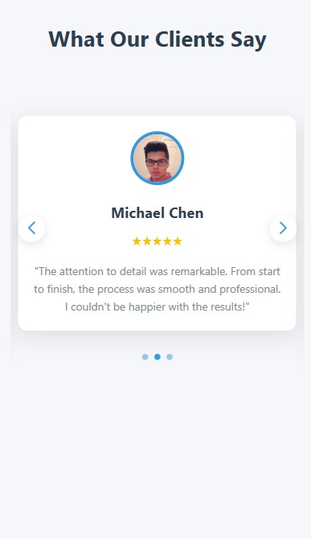

# Creating Demo Videos

This guide explains how to create demo videos for the testimonial slider showing both desktop and mobile views.

## Desktop Demo Video

### Option 1: Using FFmpeg (Command Line)

[FFmpeg](https://ffmpeg.org/) is a powerful command-line tool for video processing.

#### Installation

1. Download FFmpeg from [ffmpeg.org](https://ffmpeg.org/download.html)
2. Install it following the instructions for your operating system

#### Creating a Video from Screenshots

1. Place all your desktop view screenshots in the `screenshots` folder
2. Rename them sequentially (e.g., `desktop1.jpg`, `desktop2.jpg`, etc.)
3. Run the following command:

```bash
ffmpeg -framerate 1 -i screenshots/desktop%d.jpg -c:v libx264 -r 30 -pix_fmt yuv420p screenshots/testimonial-slider-demo.mp4
```

This will create a video where each screenshot is shown for 1 second.

### Option 2: Using Screen Recording Software

You can create a more dynamic demo by recording your screen while interacting with the slider.

#### Recommended Software

- **Windows**: [OBS Studio](https://obsproject.com/) or Xbox Game Bar (built-in)
- **macOS**: QuickTime Player (built-in) or [OBS Studio](https://obsproject.com/)
- **Linux**: [OBS Studio](https://obsproject.com/) or [SimpleScreenRecorder](https://www.maartenbaert.be/simplescreenrecorder/)

#### Steps

1. Open the testimonial slider in your browser at full desktop width
2. Start your screen recording software
3. Interact with the slider, showing its features:
   - Auto-sliding functionality
   - Manual navigation using arrows
   - Multiple testimonials visible at once
4. Stop recording and save the video
5. (Optional) Edit the video to add text explanations or trim unnecessary parts
6. Save the final video as `testimonial-slider-demo.mp4` in the `screenshots` folder

## Mobile Demo Video

### Option 1: Using Browser Developer Tools

Most modern browsers have developer tools that allow you to simulate mobile devices.

#### Steps

1. Open the testimonial slider in your browser
2. Open developer tools (F12 or right-click > Inspect)
3. Enable device simulation mode:
   - Chrome: Click the "Toggle device toolbar" button or press Ctrl+Shift+M
   - Firefox: Click the "Responsive Design Mode" button or press Ctrl+Shift+M
   - Edge: Click the "Toggle device emulation" button
4. Select a mobile device from the dropdown (e.g., iPhone 12, Galaxy S21)
5. Use screen recording software to capture the mobile view
6. Save the final video as `testimonial-slider-mobile-demo.mp4` in the `screenshots` folder

### Option 2: Using a Real Mobile Device

For the most authentic demonstration, record the slider on an actual mobile device.

#### Steps

1. Open the testimonial slider on your mobile device
2. Use the device's built-in screen recording feature:
   - iOS: Control Center > Screen Recording
   - Android: Quick Settings > Screen Record (or use a third-party app)
3. Interact with the slider to show the mobile experience
4. Stop recording and transfer the video to your computer
5. Save the final video as `testimonial-slider-mobile-demo.mp4` in the `screenshots` folder

## Option 3: Using Online Tools

You can also use online tools to create slideshows from your screenshots.

### Recommended Online Tools

- [Canva](https://www.canva.com/) - Has a free slideshow maker
- [Adobe Express](https://www.adobe.com/express/) - Offers video creation tools
- [Kapwing](https://www.kapwing.com/) - Online video editor

### Steps

1. Create separate projects for desktop and mobile views
2. Upload your screenshots to the online tool
3. Arrange them in the desired order
4. Add transitions between slides
5. Add text explanations if needed
6. Export as MP4 videos
7. Save the videos as `testimonial-slider-demo.mp4` and `testimonial-slider-mobile-demo.mp4` in the `screenshots` folder

## Adding the Videos to the README

The README already includes references to both demo videos. Once you've created the videos and saved them as `screenshots/testimonial-slider-demo.mp4` and `screenshots/testimonial-slider-mobile-demo.mp4`, the links in the README will work correctly.

If you prefer to host the videos online (e.g., on YouTube), you can update the README to link to the online videos instead:

```markdown
<div align="center">
  <a href="https://www.youtube.com/your-desktop-video-link">
    
  </a>
  <p><em>Click the image above to view the desktop demo video on YouTube</em></p>

  <a href="https://www.youtube.com/your-mobile-video-link">
    
  </a>
  <p><em>Click the image above to view the mobile demo video on YouTube</em></p>
</div>
```
